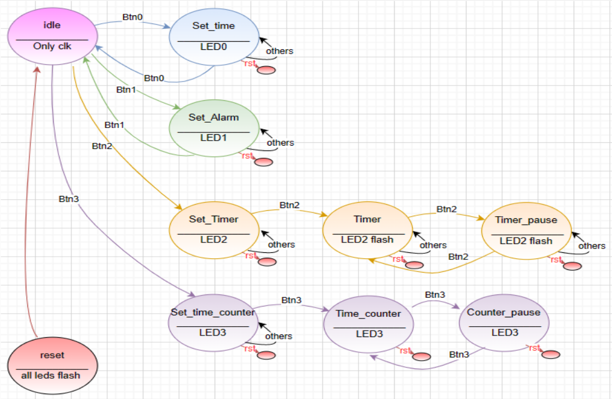

# Full-Featured-Digital-Clock


**PmodOLED demo and IP files must be added to module folder for the OLED to work**


**Digital clock code**
```vhdl
library IEEE;
use IEEE.STD_LOGIC_1164.ALL;
use IEEE.STD_LOGIC_ARITH.ALL;
use IEEE.STD_LOGIC_UNSIGNED.ALL;
use IEEE.NUMERIC_STD.ALL;
use work.package_state_machine.all;

-- Uncomment the following library declaration if using
-- arithmetic functions with Signed or Unsigned values
--use IEEE.NUMERIC_STD.ALL;

-- Uncomment the following library declaration if instantiating
-- any Xilinx leaf cells in this code.
--library UNISIM;
--use UNISIM.VComponents.all;

entity Digital_clk is
    Port ( Rx : in STD_LOGIC_VECTOR (7 downto 0);   
            clk : in STD_LOGIC;  --clock operation
       pulse_1s : in STD_LOGIC;  --clock 1 sec (pulse)
           btn0 : in STD_LOGIC; --set time
           btn1 : in STD_LOGIC; --set alarm
           btn2 : in STD_LOGIC; --set timer
           btn3 : in STD_LOGIC; --counter time
           btn4 : in STD_LOGIC; --rst
  Rx_data_ready : in STD_LOGIC; --indicate received input Hour form Rx 
       alarm_out : out STD_LOGIC; --sound alarm
     counter_out : out STD_LOGIC; --sound counter done
       state_out : out clock_state_type;
           led0  : out STD_LOGIC; --set time state on
           led1  : out STD_LOGIC; --set alarm state on
           led2  : out STD_LOGIC; --set timer state on
           led3  : out STD_LOGIC; -- counter time state on       
           H_out : out STD_LOGIC_VECTOR (7 downto 0); --hour(1)(4bit) digit and hour(0) digit (4bit) 
           M_out : out STD_LOGIC_VECTOR (7 downto 0); --minute(1) digit and minute(0) digit 
           S_out : out STD_LOGIC_VECTOR (7 downto 0)); --second(1) digit and second(0) digit 
end Digital_clk;

architecture Behavioral of Digital_clk is

signal H, H_alarm , H_timer , H_T_count: STD_LOGIC_VECTOR (7 downto 0);
signal M, M_alarm , M_timer , M_T_count: STD_LOGIC_VECTOR (7 downto 0);
signal S, S_alarm , S_timer , S_T_count: STD_LOGIC_VECTOR (7 downto 0);
signal alarm_is_set , counter_is_set:  STD_LOGIC := '0'; 
signal Rx_cnt_data :integer range 0 to 5; 

signal H_tens,H_units,M_tens,M_units,S_tens,S_units :STD_LOGIC_VECTOR (3 downto 0); 


--type state_type is (idle,set_time,set_alarm,set_timer,timer,timer_pause,counter_pause,set_time_counter,time_counter,rst);

signal fsm_state: clock_state_type := idle;

begin

state_out <= fsm_state;

fsm_process: process(clk,btn4)   -- where to go from state to state
     begin 
       if (btn4 = '1') then fsm_state <= rst;
   
       elsif (rising_edge(clk)) then 
             case (fsm_state) is 
                  when idle =>  if (btn0 = '1') then fsm_state <= set_time;
                                elsif (btn1 = '1') then fsm_state <= set_alarm;
                                elsif (btn2 = '1') then fsm_state <= set_timer;
                                elsif (btn3 = '1') then fsm_state <= set_time_counter;
                                end if;
                  
              when set_time =>  if (btn0 = '1') then fsm_state <= idle;
                                end if;
              
             when set_alarm =>  if (btn1 = '1') then fsm_state <= idle;
                                end if;                  
              
             when set_timer =>  if (btn2 = '1') then fsm_state <= timer;
                                end if;  
                              
                 when timer =>  if (btn2 = '1') then fsm_state <= timer_pause;
                                end if;     
                                
                 when timer_pause =>  if (btn2 = '1') then fsm_state <= timer;
                                end if;   
                                
      when set_time_counter =>  if (btn3 = '1') then fsm_state <= time_counter;
                                end if;
                                            
            when time_counter =>  if (btn3 = '1') then fsm_state <= counter_pause;
                                end if;
                           
            when counter_pause =>  if (btn3 = '1') then fsm_state <= time_counter;
                                end if;                                
                   
                   when rst =>  if (pulse_1s = '1') then fsm_state <= idle;
                                end if; -- if reset then stay in reset for 1 second
                                        -- and move to idle 
                   
             end case;
        end if;
end process;       
                                
fsm_task: process(clk)   -- what to do in each state
       begin 
          if (rising_edge(clk)) then
           if (fsm_state = rst) then
               led0 <= '1'; led1 <= '1'; led2 <= '1'; led3 <= '1';
               alarm_is_set <= '0';
         elsif (fsm_state = idle) then 
               led0 <= '0'; led1 <= '0'; led2 <= '0'; led3 <= '0';
               if ((pulse_1s = '1')) then
                 if (alarm_is_set = '1' and M_alarm = M and H_alarm = H and S_alarm = S) then --alarm on/off
                 alarm_out <= '1'; 
                 else
                 alarm_out <= '0';
                 end if;
                end if;
         elsif (fsm_state = set_time) then 
                led0 <= '1'; led1 <= '0'; led2 <= '0'; led3 <= '0';
         elsif (fsm_state = set_alarm) then 
                alarm_is_set <= '1';
                led0 <= '0'; led1 <= '1'; led2 <= '0'; led3 <= '0';
                  H_alarm <= (H_tens * "1010") + H_units;  --(convert back to decimal)
                  M_alarm <= (M_tens * "1010") + M_units;  --(convert back to decimal)
                  S_alarm <= (S_tens * "1010") + S_units;  --(convert back to decimal)              
         elsif (fsm_state = set_timer) then  -- set count down time
                  counter_is_set <= '1';
                  led0 <= '0'; led1 <= '0'; led2 <= '1'; led3 <= '0';
                  H_timer <= (H_tens * "1010") + H_units;  --(convert back to decimal)
                  M_timer <= (M_tens * "1010") + M_units;  --(convert back to decimal)
                  S_timer <= (S_tens * "1010") + S_units;  --(convert back to decimal)
         elsif (fsm_state = set_time_counter) then  -- set count up state
                led0 <= '0'; led1 <= '0'; led2 <= '0'; led3 <= '1';
                H_T_count <= (others => '0');
                M_T_count <= (others => '0');
                S_T_count <= (others => '0');
         elsif (fsm_state = timer) then      -- count down
               if ((pulse_1s = '1')) then
                  if (counter_is_set = '1'and M_timer=("00000000")and H_timer=("00000000")and S_timer=("00000000"))then
                  counter_out <= '1';
                  counter_is_set <= '0';
                  else
                  counter_out <= '0';
                  end if;
              if (M_timer=("00000000")and H_timer=("00000000")and S_timer=("00000000"))then
                 S_timer <= (others=>'0'); M_timer <= (others=>'0'); H_timer <= (others=>'0');
               elsif(S_timer = 0) then --// second > 59 then minute increases
                 S_timer <= std_logic_vector(to_unsigned(59,S_timer'length));   --??59                     
                 if(M_timer = 0) then -- //minute > 59 then hour increases
                   M_timer <= std_logic_vector(to_unsigned(59,M_timer'length));   --??59  
                   if (H_timer /= 0) then -- hour > 24 then set hour to 0
                     H_timer <= H_timer - 1;
                     end if;
                    else
                    M_timer<= M_timer - 1;
                    end if;
                    else
                    S_timer <= S_timer - 1;
                  end if;
                 else 
                 
               end if;
           elsif (fsm_state = time_counter) then  --count up (stop watch)
               if ((pulse_1s = '1')) then
                 if(S_T_count = 59) then --// second > 59 then minute increases
                 S_T_count  <= std_logic_vector(to_unsigned(0,S_T_count'length));                 
                 if(M_T_count = 59) then -- //minute > 59 then hour increases
                   M_T_count  <= std_logic_vector(to_unsigned(0,M_T_count'length));   
                   if (H_T_count = 23) then -- hour > 23 then set hour to 0
                     H_T_count  <= (others => '0');     
                  else
                   H_T_count <= H_T_count + 1;
                   end if;
                 else 
                    M_T_count <= M_T_count + 1;     
                 end if;
               else 
                S_T_count <= S_T_count + 1;
               end if; 
              end if;
           -- both pause state dosen't need task process.                                       
            end if;
          end if;
       end process;   
       
time_output: process(clk)
          begin
          if (rising_edge(clk)) then
           if ((fsm_state = idle) or (fsm_state = set_time)) then  
             S_out <= S;
             M_out <= M;
             H_out <= H;
           elsif  (fsm_state = set_alarm) then  
             S_out <= S_alarm;
             M_out <= M_alarm;
             H_out <= H_alarm;
           elsif ((fsm_state = set_timer) or (fsm_state = timer) or (fsm_state = timer_pause)) then
             S_out <= S_timer;
             M_out <= M_timer;
             H_out <= H_timer;
           elsif ((fsm_state = set_time_counter) or (fsm_state = time_counter) or (fsm_state = counter_pause)) then
             S_out <= S_T_count;
             M_out <= M_T_count;
             H_out <= H_T_count;
           end if;     
          end if; 
       end process; 
       
real_time: process (clk)   --not depending on state, if in state then must include it in every state
           begin
          if (rising_edge(clk)) then
            if ((pulse_1s = '1') and (fsm_state /= set_time)) then --need to make sure we are not seting time 
               if(S = 59) then --// second > 59 then minute increases
                 S <= std_logic_vector(to_unsigned(0,S_T_count'length));                 
                 if(M = 59) then -- //minute > 59 then hour increases
                   M <= std_logic_vector(to_unsigned(0,M_T_count'length));   
                   if (H = 23) then -- hour > 23 then set hour to 0
                     H <= (others => '0');     
                  else
                   H <= H + 1;
                   end if;
                 else 
                    M <= M + 1;     
                 end if;
               else 
                S <= S + 1;
               end if; 
            elsif (fsm_state = set_time) then  --read new setup time data 
                  H <= (H_tens * "1010") + H_units;  --(convert back to decimal)
                  M <= (M_tens * "1010") + M_units;  --(convert back to decimal)
                  S <= (S_tens * "1010") + S_units;  --(convert back to decimal)
            end if;
         end if; 
    end process; 
            
            
 data_counter_for_inputs: process (clk) --increment data count
  begin 
     if (rising_edge(clk)) then
       if (fsm_state = set_time or fsm_state = set_timer or fsm_state = set_alarm) then
         if ((Rx_data_ready = '1') and (Rx_cnt_data /= 5)) then
          Rx_cnt_data <= Rx_cnt_data + 1;   
         elsif ((Rx_data_ready = '1') and (Rx_cnt_data = 5)) then
          Rx_cnt_data <= 0;
         end if;
       end if;
     end if;
  end process;   
  
 time_input: process(clk)     -- time input from Rx - UART
    begin
     if (rising_edge(clk)) then
       if (fsm_state = set_time or fsm_state = set_timer or fsm_state = set_alarm) then
         if (Rx_cnt_data = 0 and Rx_data_ready = '1') then 
           H_tens <= Rx(3 downto 0);
         elsif (Rx_cnt_data = 1 and Rx_data_ready = '1') then 
           H_units <= Rx(3 downto 0);
         elsif (Rx_cnt_data = 2 and Rx_data_ready = '1') then
           M_tens <= Rx(3 downto 0);
         elsif (Rx_cnt_data = 3 and Rx_data_ready = '1') then
           M_units <= Rx(3 downto 0);
         elsif (Rx_cnt_data = 4 and Rx_data_ready = '1') then
           S_tens <= Rx(3 downto 0);
         elsif (Rx_cnt_data = 5 and Rx_data_ready = '1') then
           S_units <= Rx(3 downto 0); 
         end if;
       end if;
     end if;
  end process;
            
end Behavioral;
```

**clock divider code**
```vhdl
library IEEE;
use IEEE.STD_LOGIC_1164.ALL;
USE IEEE.STD_LOGIC_UNSIGNED.ALL;
use IEEE.NUMERIC_STD.ALL;

-- Uncomment the following library declaration if using
-- arithmetic functions with Signed or Unsigned values
--use IEEE.NUMERIC_STD.ALL;

-- Uncomment the following library declaration if instantiating
-- any Xilinx leaf cells in this code.
--library UNISIM;
--use UNISIM.VComponents.all;

entity clk_divider is
 generic(
    clk_freq    : integer := 125_000_000);  --system clock frequency in Hz       
port (
   clk: in std_logic;
   clk_1s: out std_logic
  );
end clk_divider;
architecture Behavioral of clk_divider is

signal counter: integer range 0 to clk_freq := 0;
signal clk_1s_temp : STD_LOGIC := '0';

begin

 process(clk)
 begin
  if(rising_edge(clk)) then
   counter <= counter + 1;
   if(counter>=clk_freq - 1) then -- for running on FPGA -- comment when running simulation
   clk_1s_temp <= '1';
    counter <= 0;
    else
   clk_1s_temp <= '0';
   end if;
  end if;
 end process;
 clk_1s <= clk_1s_temp; -- when counter
end Behavioral;
```

**debounce code**
```vhdl
library IEEE;
use IEEE.STD_LOGIC_1164.ALL;

-- Uncomment the following library declaration if using
-- arithmetic functions with Signed or Unsigned values
--use IEEE.NUMERIC_STD.ALL;

-- Uncomment the following library declaration if instantiating
-- any Xilinx leaf cells in this code.
--library UNISIM;
--use UNISIM.VComponents.all;

entity Debounce is
   generic(
    clk_freq    : integer := 125_000_000;  --system clock frequency in Hz
    stable_time : integer := 10);         --time button must remain stable in ms
  port(
    clk     : in  STD_LOGIC;  --input clock
    btn  : in  STD_LOGIC;  --input signal to be debounced
    result  : out STD_LOGIC := '0'); --debounced signal
end debounce;

architecture logic of debounce is

  signal glitch_free : STD_LOGIC := '0';
  signal ff_glitch_free   :  STD_LOGIC_VECTOR(1 downto 0) := "00"; --flipflop

  SIGNAL flipflops   : STD_LOGIC_VECTOR(1 downto 0) := "00"; --input flip flops for checking if input was change
  SIGNAL counter_set : STD_LOGIC;                    --sync reset to zero
begin

  counter_set <= flipflops(0) xor flipflops(1);  --determine when to start/reset counter by checking if input was change
                                                 --filter the glitches after btn pressed 
debouncing_rising_edge_clk:  process(clk)
    variable count :  integer range 0 to clk_freq*stable_time/1000;  --counter for timing 100MHz*10ms/1000
    begin                                    
      if(rising_edge(clk)) then                      --rising clock edge
      flipflops(0) <= btn;                           --store button value in 1st flipflop
      flipflops(1) <= flipflops(0);                  --store 1st flipflop value in 2nd flipflop
      if (counter_set = '1') then                     --reset counter because input is changing
        count := 0;                                    --clear the counter
      elsif (count < clk_freq*stable_time/1000) then  --stable input time is not yet met
        count := count + 1;                            --increment counter
      else                                           --stable input time is met
        glitch_free <= flipflops(1);                        --output the stable value
      end if;    
    end if;
  end process;
  
stable_pulse: process (clk) 
     begin                                    
      if(rising_edge(clk)) then   
        if ( (ff_glitch_free(0) and (not ff_glitch_free(1))) = '1' )  then 
        result <= '1';
        else 
        result <= '0';
        end if;
        ff_glitch_free(0) <= glitch_free;
        ff_glitch_free(1) <= ff_glitch_free(0);
      end if;
     end process;   
  
end logic;
```
**alarm sound code**
```vhdl
library IEEE;
use IEEE.STD_LOGIC_1164.ALL;
use IEEE.NUMERIC_STD.ALL;
use IEEE.STD_LOGIC_ARITH.ALL;
use IEEE.STD_LOGIC_UNSIGNED.ALL;

-- Uncomment the following library declaration if using
-- arithmetic functions with Signed or Unsigned values
--use IEEE.NUMERIC_STD.ALL;

-- Uncomment the following library declaration if instantiating
-- any Xilinx leaf cells in this code.
--library UNISIM;
--use UNISIM.VComponents.all;

entity alarm_sound is     -- generate sound for 3 seconds
    Port ( clk : in STD_LOGIC;
           sound_ena : in STD_LOGIC;
         counter_out : in STD_LOGIC;
           sound_out : out STD_LOGIC);
end alarm_sound;

architecture Behavioral of alarm_sound is

signal counter: integer range 0 to 25000 := 0;
signal length_sound: integer range 0 to 375000000 :=0;  --(3s)

begin
Alarm_sound: process(clk)
  begin
    if (rising_edge(clk)) then
      if (sound_ena = '1' or counter_out = '1' or length_sound /= 0) then  
        length_sound <= length_sound + 1;
        counter <= counter + 1;
        if (counter <= 6250) then  
        sound_out <= '1';
        elsif (counter <25000 and counter>6250) then
        sound_out <= '0';
        end if;
       end if;
      end if;  
end process;
end Behavioral;
```
**binary to bcd code**
```vhdl
library IEEE;
use IEEE.STD_LOGIC_1164.ALL;
use ieee.std_logic_unsigned.all;

-- Uncomment the following library declaration if using
-- arithmetic functions with Signed or Unsigned values
--use IEEE.NUMERIC_STD.ALL;

-- Uncomment the following library declaration if instantiating
-- any Xilinx leaf cells in this code.
--library UNISIM;
--use UNISIM.VComponents.all;

entity binary_bcd is
    generic(N: positive := 8);
    port(
        clk, reset: in std_logic;
        binary_in: in std_logic_vector(N-1 downto 0);
        bcd0, bcd1 : out std_logic_vector(3 downto 0)
    );
end binary_bcd ;
 
architecture behaviour of binary_bcd is
    type states is (start, shift, done);
    signal state, state_next: states;
 
    signal binary, binary_next: std_logic_vector(N-1 downto 0);
    signal bcds, bcds_reg, bcds_next: std_logic_vector(7 downto 0);
    -- output register keep output constant during conversion
    signal bcds_out_reg, bcds_out_reg_next: std_logic_vector(7 downto 0);
    -- need to keep track of shifts
    signal shift_counter, shift_counter_next: natural range 0 to N;
begin
 
    process(clk, reset)
    begin
        if reset = '1' then
            binary <= (others => '0');
            bcds <= (others => '0');
            state <= start;
            bcds_out_reg <= (others => '0');
            shift_counter <= 0;
        elsif falling_edge(clk) then
            binary <= binary_next;
            bcds <= bcds_next;
            state <= state_next;
            bcds_out_reg <= bcds_out_reg_next;
            shift_counter <= shift_counter_next;
        end if;
    end process;
 
    convert:
    process(state, binary, binary_in, bcds, bcds_reg, shift_counter)
    begin
        state_next <= state;
        bcds_next <= bcds;
        binary_next <= binary;
        shift_counter_next <= shift_counter;
 
        case state is
            when start =>
                state_next <= shift;
                binary_next <= binary_in;
                bcds_next <= (others => '0');
                shift_counter_next <= 0;
            when shift =>
                if shift_counter = N then
                    state_next <= done;
                else
                    binary_next <= binary(N-2 downto 0) & 'L';
                    bcds_next <= bcds_reg(6 downto 0) & binary(N-1);
                    shift_counter_next <= shift_counter + 1;
                end if;
            when done =>
                state_next <= start;
        end case;
    end process;
 
    bcds_reg(7 downto 4) <= bcds(7 downto 4) + 3 when bcds(7 downto 4) > 4 else
                            bcds(7 downto 4);
    bcds_reg(3 downto 0) <= bcds(3 downto 0) + 3 when bcds(3 downto 0) > 4 else
                            bcds(3 downto 0);
 
    bcds_out_reg_next <= bcds when state = done else
                         bcds_out_reg;
 

    bcd1 <= bcds_out_reg(7 downto 4);
    bcd0 <= bcds_out_reg(3 downto 0);
 
end behaviour;
```

**UART code**
```vhdl
library IEEE;
use IEEE.STD_LOGIC_1164.ALL;
use ieee.numeric_std.all;
-- Uncomment the following library declaration if using
-- arithmetic functions with Signed or Unsigned values
--use IEEE.NUMERIC_STD.ALL;

-- Uncomment the following library declaration if instantiating
-- any Xilinx leaf cells in this code.
--library UNISIM;
--use UNISIM.VComponents.all;

entity UART_rx is
  Port (
        CLK 	: in  STD_LOGIC;
        Rx_in   : in  STD_LOGIC;
        
      Data_out  : out STD_LOGIC_VECTOR(7 downto 0);
       Data_rdy : out STD_LOGIC
   );
   
   
   
end UART_rx;

architecture Behavioral of UART_rx is

type state_machine_uart is (IDLE,START_BIT,DATA,END_BIT);

-- CLK_PER_BIT = (Frequency of CLK)/(Frequency of UART)
-- CLK_PER_BIT = 125M / 9600 = 13020

constant CLK_PER_BIT : integer := 13020;

signal state_machine : state_machine_uart := IDLE;

signal CLK_counter : integer range 0 to CLK_PER_BIT-1 := 0;
signal DATA_cnt    : integer range 0 to 7 := 0;

signal Data_out_reg : STD_LOGIC_VECTOR (7 downto 0);

begin

UART_rx_process : process(CLK)  --where to go from state to state if condition met 
begin
  if(rising_edge(CLK)) then
    case state_machine is
    
      when IDLE => if(Rx_in = '0') then-- Start detected
                     state_machine <= START_BIT;
                   end if;  
  
 when START_BIT => if(CLK_counter = CLK_PER_BIT/2) then -- Half of UART baud rate to find the middle
                     state_machine <= DATA;
                   end if; 
                    
      when DATA => if(DATA_cnt = 7 and CLK_counter = CLK_PER_BIT - 1) then -- Data over
                     state_machine <= END_BIT;
                   end if;  

   when END_BIT => if(CLK_counter = CLK_PER_BIT - 1) then -- Go back to idle
                     state_machine <= IDLE;
                   end if;  
    end case; 
  end if;
end process;

Counters_process : process(CLK)  --what to do in each state
begin
if(rising_edge(CLK)) then
  if(state_machine = START_BIT) then     -- reset at mid bit
    if(CLK_counter = CLK_PER_BIT/2) then
      CLK_counter <= 0;
      DATA_cnt    <= 0;
    else 
      CLK_counter <= CLK_counter + 1;
    end if;
  elsif(state_machine /= IDLE) then -- All other states other than IDLE - in idle nothing happened
    if(CLK_counter = CLK_PER_BIT - 1) then      
      DATA_cnt    <= DATA_cnt + 1;
      CLK_counter <= 0;
    else
      CLK_counter <= CLK_counter + 1;
    end if;
  end if; 
end if; 
end process;

Data_out_process : process(CLK)    --every signal has it's own process 
begin
  if(rising_edge(CLK)) then
    if(state_machine = DATA and CLK_counter = CLK_PER_BIT - 1) then
      Data_out_reg(7) <= Rx_in;     --Sample the Rx_in      
      Data_out_reg(6 downto 0) <= Data_out_reg(7 downto 1); -- Right shift -(Rx_in,z,z,z,z,z,z,z,z) untill it's full
    end if;
  end if;
end process;

Data_out <= Data_out_reg;   --(230900) = (23:09:00)

Data_rdy_process : process(CLK)      -- flag process 
begin
  if(rising_edge(CLK)) then
    if(state_machine = DATA and DATA_cnt = 7 and CLK_counter = CLK_PER_BIT - 1) then
      Data_rdy <= '1';
    else 
      Data_rdy <= '0';
    end if;
  end if;
end process;

end Behavioral;
```
**PmodOLED code**
```vhdl
library IEEE; 
use IEEE.STD_LOGIC_1164.ALL;
use ieee.std_logic_unsigned.ALL;
use ieee.std_logic_arith.all;
use work.package_state_machine.all;

entity PmodOLEDCtrl is
	Port ( 
		CLK 	: in  STD_LOGIC;
		
		CS  	: out STD_LOGIC;
		SDIN	: out STD_LOGIC;
		SCLK	: out STD_LOGIC;
		DC		: out STD_LOGIC;
		RES	: out STD_LOGIC;
		VBAT	: out STD_LOGIC;
		VDD	: out STD_LOGIC;
		state_in : in clock_state_type;
		pulse_1sec : in STD_LOGIC;
		H_tens,H_units : in STD_LOGIC_VECTOR(3 downto 0);
		M_tens,M_units : in STD_LOGIC_VECTOR(3 downto 0);
		S_tens,S_units : in STD_LOGIC_VECTOR(3 downto 0));
end PmodOLEDCtrl;

architecture Behavioral of PmodOLEDCtrl is

component OledInit is
Port ( CLK 	: in  STD_LOGIC;
		RST 	: in	STD_LOGIC;
		EN		: in  STD_LOGIC;
		CS  	: out STD_LOGIC;
		SDO	: out STD_LOGIC;
		SCLK	: out STD_LOGIC;
		DC		: out STD_LOGIC;
		RES	: out STD_LOGIC;
		VBAT	: out STD_LOGIC;
		VDD	: out STD_LOGIC;
		FIN  : out STD_LOGIC);
end component;

component OledEx is
    Port ( CLK 	: in  STD_LOGIC;
    pulse_1sec  : in  STD_LOGIC;
		RST 	: in  STD_LOGIC;
		EN		: in  STD_LOGIC;
		CS  	: out STD_LOGIC;
		SDO		: out STD_LOGIC;
		SCLK	: out STD_LOGIC;
		DC		: out STD_LOGIC;
		state_in : in clock_state_type;
		H_tens,H_units : in STD_LOGIC_VECTOR(3 downto 0);
        M_tens,M_units : in STD_LOGIC_VECTOR(3 downto 0);
        S_tens,S_units : in STD_LOGIC_VECTOR(3 downto 0));
end component;

type states is (Idle,
					OledInitialize,
					OledExample,
					Done);

signal current_state 	: states := Idle;

signal init_en				: STD_LOGIC := '0';
signal init_done			: STD_LOGIC;
signal init_cs				: STD_LOGIC;
signal init_sdo			: STD_LOGIC;
signal init_sclk			: STD_LOGIC;
signal init_dc				: STD_LOGIC;

signal example_en			: STD_LOGIC := '0';
signal example_cs			: STD_LOGIC;
signal example_sdo		: STD_LOGIC;
signal example_sclk		: STD_LOGIC;
signal example_dc			: STD_LOGIC;
signal example_done		: STD_LOGIC;

signal RST              : STD_LOGIC := '0';

begin

	Init: OledInit port map(
	       CLK => CLK, 
	       RST => RST, 
	       EN  => init_en, 
	       CS  => init_cs, 
	       SDO => init_sdo, 
	       SCLK=> init_sclk, 
	       DC  => init_dc, 
	       RES => RES, 
	       VBAT=> VBAT, 
	       VDD => VDD, 
	       FIN => init_done);
	
	Example: OledEx Port map(
	       CLK => CLK, 
	       pulse_1sec => pulse_1sec,
	       RST => RST, 
	       EN  => example_en, 
	       CS  => example_cs, 
	       SDO => example_sdo, 
	       SCLK => example_sclk, 
	       DC   => example_dc, 
	       state_in => state_in,
	       H_tens => H_tens,
	       H_units => H_units,
	       M_tens => M_tens,
	       M_units => M_units,
	       S_tens => S_tens,
	       S_units => S_units
	       );
	
	--MUXes to indicate which outputs are routed out depending on which block is enabled
	CS <= init_cs when (current_state = OledInitialize) else
			example_cs;
	SDIN <= init_sdo when (current_state = OledInitialize) else
			example_sdo;
	SCLK <= init_sclk when (current_state = OledInitialize) else
			example_sclk;
	DC <= init_dc when (current_state = OledInitialize) else
			example_dc;
	--END output MUXes
	
	--MUXes that enable blocks when in the proper states
	init_en <= '1' when (current_state = OledInitialize) else
					'0';
					
	example_en <= '1' when (current_state = OledExample) else
					'0';
	--END enable MUXes
	

	process(CLK)
	begin
		if(rising_edge(CLK)) then
			if(RST = '1') then
				current_state <= Idle;
			else
				case(current_state) is
					when Idle =>
						current_state <= OledInitialize;
					--Go through the initialization sequence
					when OledInitialize =>
						if(init_done = '1') then
							current_state <= OledExample;
						end if;
					--Do example and Do nothing when finished
					when OledExample =>
						if(example_done = '1') then
							current_state <= Done;
						end if;
					--Do Nothing
					when Done =>
						current_state <= Done;
					when others =>
						current_state <= Idle;
				end case;
			end if;
		end if;
	end process;
	
	
end Behavioral;
```

**PmodOLED example code (which mainly used and modify for the design)**
```vhdl
library IEEE;
use IEEE.STD_LOGIC_1164.ALL;
use IEEE.STD_LOGIC_ARITH.ALL;
use IEEE.STD_LOGIC_UNSIGNED.ALL;
use work.package_state_machine.all;

entity OledEx is
    Port ( CLK 	: in  STD_LOGIC; --System CLK
           pulse_1sec : in STD_LOGIC;
			  RST 	: in	STD_LOGIC; --Synchronous Reset
			  EN		: in  STD_LOGIC; --Example block enable pin
			  CS  	: out STD_LOGIC; --SPI Chip Select
			  SDO		: out STD_LOGIC; --SPI Data out
			  SCLK	: out STD_LOGIC; --SPI Clock
			  DC		: out STD_LOGIC; --Data/Command Controller
			  state_in : in clock_state_type;
			  H_tens,H_units : in STD_LOGIC_VECTOR(3 downto 0);
              M_tens,M_units : in STD_LOGIC_VECTOR(3 downto 0);
              S_tens,S_units : in STD_LOGIC_VECTOR(3 downto 0)
			  );--Finish flag for example block
end OledEx;

architecture Behavioral of OledEx is

--SPI Controller Component
COMPONENT SpiCtrl
    PORT(
         CLK : IN  std_logic;
         RST : IN  std_logic;
         SPI_EN : IN  std_logic;
         SPI_DATA : IN  std_logic_vector(7 downto 0);
         CS : OUT  std_logic;
         SDO : OUT  std_logic;
         SCLK : OUT  std_logic;
         SPI_FIN : OUT  std_logic
        );
    END COMPONENT;

--Delay Controller Component
COMPONENT Delay
    PORT(
         CLK : IN  std_logic;
         RST : IN  std_logic;
         DELAY_MS : IN  std_logic_vector(11 downto 0);
         DELAY_EN : IN  std_logic;
         DELAY_FIN : OUT  std_logic
        );
    END COMPONENT;
	 
--Character Library, Latency = 1
COMPONENT charLib
  PORT (
    clka : IN STD_LOGIC; --Attach System Clock to it
    addra : IN STD_LOGIC_VECTOR(10 DOWNTO 0); --First 8 bits is the ASCII value of the character the last 3 bits are the parts of the char
    douta : OUT STD_LOGIC_VECTOR(7 DOWNTO 0) --Data byte out
  );
END COMPONENT;

--States for state machine
type states is (Idle,
				ClearDC,
				SetPage,
				PageNum,
				LeftColumn1,
				LeftColumn2,
				SetDC,
				HomeScreen,
				Wait1,
				ClearScreen,
				Wait2,
				TimeScreen,
				UpdateScreen,
				SendChar1,
				SendChar2,
				SendChar3,
				SendChar4,
				SendChar5,
				SendChar6,
				SendChar7,
				SendChar8,
				ReadMem,
				ReadMem2,
				WaitTime,
				Transition1,
				Transition2,
				Transition3,
				Transition4,
				Transition5
					);
type OledRowMem is array (0 to 15) of STD_LOGIC_VECTOR(7 downto 0);

type OledMem is array(0 to 3,0 to 15) of STD_LOGIC_VECTOR(7 downto 0);

--Variable that contains what the screen will be after the next UpdateScreen state
signal current_screen : OledMem; 

--Constant that contains the screen filled with the Home screen
--Row 1 = Blank
--Row 2 = Welcome to 
--Row 3 = Digital Clock! 
--Row 4 = Blank
constant home_screen : OledMem := ((X"20",X"20",X"20",X"20",X"20",X"20",X"20",X"20",X"20",X"20",X"20",X"20",X"20",X"20",X"20",X"20"),	
												(X"20",X"20",X"20",X"57",X"65",X"63",X"6f",X"6d",X"65",X"20",X"74",X"6f",X"20",X"20",X"20",X"20"),
												(X"20",X"44",X"69",X"67",X"69",X"74",X"61",X"6c",X"20",X"43",X"6c",X"6f",X"63",X"6b",X"21",X"20"),
												(X"20",X"20",X"20",X"20",X"20",X"20",X"20",X"20",X"20",X"20",X"20",X"20",X"20",X"20",X"20",X"20"));

--Constants for state machine row 
-- states headers 
-- Row = Time
constant time_row  : OledRowMem := (X"20",X"20",X"20",X"20",X"20",X"20",X"54",X"69",X"6d",X"65",X"20",X"20",X"20",X"20",X"20",X"20");

-- Row = Set time
constant set_time_row  : OledRowMem := (X"20",X"20",X"20",X"20",X"53",X"65",X"74",X"20",X"74",X"69",X"6d",X"65",X"20",X"20",X"20",X"20");

-- Row = Set alarm 
constant set_alarm_row  : OledRowMem := (X"20",X"20",X"20",X"20",X"53",X"65",X"74",X"20",X"61",X"6c",X"61",X"72",X"6d",X"20",X"20",X"20");

-- Row = Set timer                                                   
constant set_timer_row  : OledRowMem := (X"20",X"20",X"20",X"20",X"53",X"65",X"74",X"20",X"74",X"69",X"6d",X"65",X"72",X"20",X"20",X"20");

-- Row = Timer                                                   
constant timer_row  : OledRowMem := (X"20",X"20",X"20",X"20",X"20",X"54",X"69",X"6d",X"65",X"72",X"20",X"20",X"20",X"20",X"20",X"20");

-- Row = Timer paused                                                                             
constant timer_pause_row  : OledRowMem := (X"20",X"20",X"54",X"69",X"6d",X"65",X"72",X"20",X"70",X"61",X"75",X"73",X"65",X"64",X"20",X"20");

-- Row = Stop watch             
constant time_counter_row  : OledRowMem := (X"20",X"20",X"20",X"53",X"74",X"6f",X"70",X"20",X"77",X"61",X"74",X"63",X"68",X"20",X"20",X"20");

-- Row = Stop watch paused            
constant time_counter_pause_row  : OledRowMem := (X"53",X"74",X"6f",X"70",X"20",X"77",X"61",X"74",X"63",X"68",X"70",X"61",X"75",X"73",X"65",X"64");

--Constant that contains the screen filled with the time screen
--Row 1 = State Machine info
--Row 2 = Blank
--Row 3 = Hh : Mm : Ss   --Here HH,MM,SS corresponds to actual time from other module H position 3,4, M -> 8,9, S-> 13,14
--Row 4 = Hh   Mm   Ss   
signal time_screen : OledMem :=                ((X"20",X"20",X"20",X"20",X"20",X"20",X"20",X"20",X"20",X"20",X"20",X"20",X"20",X"20",X"20",X"20"),	
												(X"20",X"20",X"20",X"20",X"20",X"20",X"20",X"20",X"20",X"20",X"20",X"20",X"20",X"20",X"20",X"20"),
												(X"20",X"20",X"20",X"20",X"20",X"20",X"3a",X"20",X"20",X"20",X"20",X"3a",X"20",X"20",X"20",X"20"),
												(X"20",X"20",X"20",X"48",X"68",X"20",X"20",X"20",X"4d",X"6d",X"20",X"20",X"20",X"53",X"73",X"20"));
                                              --(0 ,  1  ,  2  , H_tens , H_unit  , 5  , : ,  7 .....)
--Constant that fills the screen with blank (spaces) entries
constant clear_screen : OledMem :=   ((X"20",X"20",X"20",X"20",X"20",X"20",X"20",X"20",X"20",X"20",X"20",X"20",X"20",X"20",X"20",X"20"),	
												(X"20",X"20",X"20",X"20",X"20",X"20",X"20",X"20",X"20",X"20",X"20",X"20",X"20",X"20",X"20",X"20"),
												(X"20",X"20",X"20",X"20",X"20",X"20",X"20",X"20",X"20",X"20",X"20",X"20",X"20",X"20",X"20",X"20"),
												(X"20",X"20",X"20",X"20",X"20",X"20",X"20",X"20",X"20",X"20",X"20",X"20",X"20",X"20",X"20",X"20"));

--Current overall state of the state machine
signal current_state : states := Idle;
--State to go to after the SPI transmission is finished
signal after_state : states;
--State to go to after the set page sequence
signal after_page_state : states;
--State to go to after sending the character sequence
signal after_char_state : states;
--State to go to after the UpdateScreen is finished
signal after_update_state : states;

--Contains the value to be outputted to DC
signal temp_dc : STD_LOGIC := '0';

--Variables used in the Delay Controller Block
signal temp_delay_ms : STD_LOGIC_VECTOR (11 downto 0); --amount of ms to delay
signal temp_delay_en : STD_LOGIC := '0'; --Enable signal for the delay block
signal temp_delay_fin : STD_LOGIC; --Finish signal for the delay block

--Variables used in the SPI controller block
signal temp_spi_en : STD_LOGIC := '0'; --Enable signal for the SPI block
signal temp_spi_data : STD_LOGIC_VECTOR (7 downto 0) := (others => '0'); --Data to be sent out on SPI
signal temp_spi_fin : STD_LOGIC; --Finish signal for the SPI block

signal temp_char : STD_LOGIC_VECTOR (7 downto 0) := (others => '0'); --Contains ASCII value for character
signal temp_addr : STD_LOGIC_VECTOR (10 downto 0) := (others => '0'); --Contains address to BYTE needed in memory
signal temp_dout : STD_LOGIC_VECTOR (7 downto 0); --Contains byte outputted from memory
signal temp_page : STD_LOGIC_VECTOR (1 downto 0) := (others => '0'); --Current page
signal temp_index : integer range 0 to 15 := 0; --Current character on page
---------------- edit ----
signal H_10_ascii,H_1_ascii : STD_LOGIC_VECTOR (7 downto 0);   -- added for time display Hour
signal M_10_ascii,M_1_ascii : STD_LOGIC_VECTOR (7 downto 0);    -- added for time display Minutes
signal S_10_ascii,S_1_ascii : STD_LOGIC_VECTOR (7 downto 0);     -- added for time display Seconds

begin
DC <= temp_dc;

--Instantiate SPI Block
 SPI_COMP: SpiCtrl PORT MAP (
          CLK => CLK,
          RST => RST,
          SPI_EN => temp_spi_en,
          SPI_DATA => temp_spi_data,
          CS => CS,
          SDO => SDO,
          SCLK => SCLK,
          SPI_FIN => temp_spi_fin
        );
--Instantiate Delay Block
   DELAY_COMP: Delay PORT MAP (
          CLK => CLK,
          RST => RST,
          DELAY_MS => temp_delay_ms,
          DELAY_EN => temp_delay_en,
          DELAY_FIN => temp_delay_fin
        );
--Instantiate Memory Block
	CHAR_LIB_COMP : charLib
  PORT MAP (
    clka => CLK,
    addra => temp_addr,
    douta => temp_dout
  );
	process (CLK)
	begin
		if(rising_edge(CLK)) then
			case(current_state) is
				--Idle until EN pulled high than intialize Page to 0 and go to state Alphabet afterwards
				when Idle => 
					if(EN = '1') then
						current_state <= ClearDC;
						after_page_state <= HomeScreen;
						temp_page <= "00";
					end if;
				--Set current_screen to constant home_screen and update the screen.  Go to state Wait1 afterwards
				when HomeScreen => 
					current_screen <= home_screen;
					current_state <= UpdateScreen;
					after_update_state <= Wait1;
				--Wait 4 seconds and go to ClearScreen
				when Wait1 => 
					temp_delay_ms <= "001111101000"; --1000
					after_state <= ClearScreen;
					current_state <= Transition3; --Transition3 = The delay transition states
				--set current_screen to constant clear_screen and update the screen. Go to state Wait2 afterwards
--					current_state <= Transition3; --Transition3 = The delay transition states
--				--set current_screen to constant clear_screen and update the screen. Go to state Wait2 afterwards
				when ClearScreen =>                       --******Loop of state times
					current_screen <= clear_screen;
					after_update_state <= Wait2;
					current_state <= UpdateScreen;
				--Wait 1ms and go to DigilentScreen
				when Wait2 =>
					temp_delay_ms <= "000000000001"; --1ms
					after_state <= TimeScreen;
					current_state <= Transition3; --Transition3 = The delay transition states
				--Set currentScreen to changing time_screen and update the screen. Go to state Done afterwards
				when TimeScreen =>                    -- time screen added
					current_screen <= time_screen;    -- time screen added
					after_update_state <= WaitTime;
					current_state <= UpdateScreen;
				--Do nothing until 1 second pulse comes and then current_state is Wait1 again to display time
				when WaitTime	=>               -- time of second added
					if(pulse_1sec = '1') then  --Update time every second						
                        current_state <= ClearScreen;
					end if;
					
				--UpdateScreen State
				--1. Gets ASCII value from current_screen at the current page and the current spot of the page
				--2. If on the last character of the page transition update the page number, if on the last page(3)
				--			then the updateScreen go to "after_update_state" after 
				when UpdateScreen =>
					temp_char <= current_screen(CONV_INTEGER(temp_page),temp_index);
					if(temp_index = 15) then	
						temp_index <= 0;
						temp_page <= temp_page + 1;
						after_char_state <= ClearDC;
						if(temp_page = "11") then
							after_page_state <= after_update_state;
						else	
							after_page_state <= UpdateScreen;
						end if;
					else
						temp_index <= temp_index + 1;
						after_char_state <= UpdateScreen;
					end if;
					current_state <= SendChar1;
				
				--Update Page states
				--1. Sets DC to command mode
				--2. Sends the SetPage Command
				--3. Sends the Page to be set to
				--4. Sets the start pixel to the left column
				--5. Sets DC to data mode
				when ClearDC =>
					temp_dc <= '0';
					current_state <= SetPage;
				when SetPage =>
					temp_spi_data <= "00100010";
					after_state <= PageNum;
					current_state <= Transition1;
				when PageNum =>
					temp_spi_data <= "000000" & temp_page;
					after_state <= LeftColumn1;
					current_state <= Transition1;
				when LeftColumn1 =>
					temp_spi_data <= "00000000";
					after_state <= LeftColumn2;
					current_state <= Transition1;
				when LeftColumn2 =>
					temp_spi_data <= "00010000";
					after_state <= SetDC;
					current_state <= Transition1;
				when SetDC =>
					temp_dc <= '1';
					current_state <= after_page_state;
				--End Update Page States

				--Send Character States
				--1. Sets the Address to ASCII value of char with the counter appended to the end
				--2. Waits a clock for the data to get ready by going to ReadMem and ReadMem2 states
				--3. Send the byte of data given by the block Ram
				--4. Repeat 7 more times for the rest of the character bytes
				when SendChar1 =>
					temp_addr <= temp_char & "000";
					after_state <= SendChar2;
					current_state <= ReadMem;
				when SendChar2 =>
					temp_addr <= temp_char & "001";
					after_state <= SendChar3;
					current_state <= ReadMem;
				when SendChar3 =>
					temp_addr <= temp_char & "010";
					after_state <= SendChar4;
					current_state <= ReadMem;
				when SendChar4 =>
					temp_addr <= temp_char & "011";
					after_state <= SendChar5;
					current_state <= ReadMem;
				when SendChar5 =>
					temp_addr <= temp_char & "100";
					after_state <= SendChar6;
					current_state <= ReadMem;
				when SendChar6 =>
					temp_addr <= temp_char & "101";
					after_state <= SendChar7;
					current_state <= ReadMem;
				when SendChar7 =>
					temp_addr <= temp_char & "110";
					after_state <= SendChar8;
					current_state <= ReadMem;
				when SendChar8 =>
					temp_addr <= temp_char & "111";
					after_state <= after_char_state;
					current_state <= ReadMem;
				when ReadMem =>
					current_state <= ReadMem2;
				when ReadMem2 =>
					temp_spi_data <= temp_dout;
					current_state <= Transition1;
				--End Send Character States
					
				--SPI transitions
				--1. Set SPI_EN to 1
				--2. Waits for SpiCtrl to finish
				--3. Goes to clear state (Transition5)
				when Transition1 =>
					temp_spi_en <= '1';
					current_state <= Transition2;
				when Transition2 =>
					if(temp_spi_fin = '1') then
						current_state <= Transition5;
					end if;
					
				--Delay Transitions
				--1. Set DELAY_EN to 1
				--2. Waits for Delay to finish
				--3. Goes to Clear state (Transition5)
				when Transition3 =>
					temp_delay_en <= '1';
					current_state <= Transition4;
				when Transition4 =>
					if(temp_delay_fin = '1') then
						current_state <= Transition5;
					end if;
				
				--Clear transition
				--1. Sets both DELAY_EN and SPI_EN to 0
				--2. Go to after state
				when Transition5 =>
					temp_spi_en <= '0';
					temp_delay_en <= '0';
					current_state <= after_state;
				--END SPI transitions
				--END Delay Transitions
				--END Clear transition
			
				when others 		=>
					current_state <= Idle;
			end case;
		end if;
	end process;
	
	process(CLK)        -- actual time display 
	begin
	  if(rising_edge(CLK)) then
	    -- Converting BCD  to Ascii by using concatenation
	    H_10_ascii <= X"3" & H_tens;   --(30 & 0011) = 33  => 3  need to convert to hex
	    H_1_ascii  <= X"3" & H_units; 
	    M_10_ascii <= X"3" & M_tens; 
	    M_1_ascii  <= X"3" & M_units; 
	    S_10_ascii <= X"3" & S_tens; 
	    S_1_ascii  <= X"3" & S_units; 
	    time_screen(2,3) <= H_10_ascii;  --(second row,third charecter Hour time) 
	    time_screen(2,4) <= H_1_ascii;
	    time_screen(2,8) <= M_10_ascii;
	    time_screen(2,9) <= M_1_ascii;
	    time_screen(2,13) <= S_10_ascii;
	    time_screen(2,14) <= S_1_ascii;
	    
	    case(state_in) is    -- header use
	    
	       when idle => 
	         for I in 0 to 15 loop           -- every row has 16 charecters 
	           time_screen(0,I) <= time_row(I);
	         end loop;
	       
	       when set_time => 
	         for I in 0 to 15 loop
               time_screen(0,I) <= set_time_row(I);
             end loop;

	       when set_alarm => 
	         for I in 0 to 15 loop
               time_screen(0,I) <= set_alarm_row(I);
             end loop;

	       when set_timer => 
	         for I in 0 to 15 loop
               time_screen(0,I) <= set_timer_row(I);
             end loop;

	       when timer => 
	         for I in 0 to 15 loop
               time_screen(0,I) <= timer_row(I);
             end loop;

	       when time_counter => 
	         for I in 0 to 15 loop
               time_screen(0,I) <= time_counter_row(I);
             end loop;
           
           when others =>
             for I in 0 to 15 loop
                time_screen(0,I) <= time_screen(0,I);         --All other states hold the previous state values
             end loop; 
	    end case;
	  end if;
	end process;
	
end Behavioral;
```

**constraint file code**
```vhdl
## This file is a general .xdc for the Nexys4 rev B board
## To use it in a project:
## - uncomment the lines corresponding to used pins
## - rename the used ports (in each line, after get_ports) according to the top level signal names in the project

# Clock signal
#Bank = 35, Pin name = IO_L12P_T1_MRCC_35,					Sch name = CLK100MHZ

#Clock signal
set_property -dict { PACKAGE_PIN K17   IOSTANDARD LVCMOS33 } [get_ports { clk }]; #IO_L12P_T1_MRCC_35 Sch=sysclk
create_clock -add -name sys_clk_pin -period 8.00 -waveform {0 4} [get_ports { clk }];

#Switches
set_property -dict { PACKAGE_PIN G15   IOSTANDARD LVCMOS33 } [get_ports { btn4_T }]; #IO_L19N_T3_VREF_35 Sch=sw[0]
#set_property -dict { PACKAGE_PIN P15   IOSTANDARD LVCMOS33 } [get_ports { sw[1] }]; #IO_L24P_T3_34 Sch=sw[1]
#set_property -dict { PACKAGE_PIN W13   IOSTANDARD LVCMOS33 } [get_ports { sw[2] }]; #IO_L4N_T0_34 Sch=sw[2]
#set_property -dict { PACKAGE_PIN T16   IOSTANDARD LVCMOS33 } [get_ports { sw[3] }]; #IO_L9P_T1_DQS_34 Sch=sw[3]

#Buttons
set_property -dict { PACKAGE_PIN K18   IOSTANDARD LVCMOS33 } [get_ports { btn0_T }]; #IO_L12N_T1_MRCC_35 Sch=btn[0]
set_property -dict { PACKAGE_PIN P16   IOSTANDARD LVCMOS33 } [get_ports { btn1_T }]; #IO_L24N_T3_34 Sch=btn[1]
set_property -dict { PACKAGE_PIN K19   IOSTANDARD LVCMOS33 } [get_ports { btn2_T }]; #IO_L10P_T1_AD11P_35 Sch=btn[2]
set_property -dict { PACKAGE_PIN Y16   IOSTANDARD LVCMOS33 } [get_ports { btn3_T }]; #IO_L7P_T1_34 Sch=btn[3]


#LEDs
set_property -dict { PACKAGE_PIN M14   IOSTANDARD LVCMOS33 } [get_ports { led0 }]; #IO_L23P_T3_35 Sch=led[0]
set_property -dict { PACKAGE_PIN M15   IOSTANDARD LVCMOS33 } [get_ports { led1 }]; #IO_L23N_T3_35 Sch=led[1]
set_property -dict { PACKAGE_PIN G14   IOSTANDARD LVCMOS33 } [get_ports { led2 }]; #IO_0_35 Sch=led[2]
set_property -dict { PACKAGE_PIN D18   IOSTANDARD LVCMOS33 } [get_ports { led3 }]; #IO_L3N_T0_DQS_AD1N_35 Sch=led[3]

##Pmod Header JD                                                                                                                  
set_property -dict { PACKAGE_PIN T14   IOSTANDARD LVCMOS33     } [get_ports { CS }]; #IO_L5P_T0_34 Sch=jd_p[1]                  
set_property -dict { PACKAGE_PIN T15   IOSTANDARD LVCMOS33     } [get_ports { SDIN }]; #IO_L5N_T0_34 Sch=jd_n[1]				 
#set_property -dict { PACKAGE_PIN P14   IOSTANDARD LVCMOS33     } [get_ports { jd[2] }]; #IO_L6P_T0_34 Sch=jd_p[2]                  
set_property -dict { PACKAGE_PIN R14   IOSTANDARD LVCMOS33     } [get_ports { SCLK }]; #IO_L6N_T0_VREF_34 Sch=jd_n[2]             
set_property -dict { PACKAGE_PIN U14   IOSTANDARD LVCMOS33     } [get_ports { DC }]; #IO_L11P_T1_SRCC_34 Sch=jd_p[3]            
set_property -dict { PACKAGE_PIN U15   IOSTANDARD LVCMOS33     } [get_ports { RES }]; #IO_L11N_T1_SRCC_34 Sch=jd_n[3]            
set_property -dict { PACKAGE_PIN V17   IOSTANDARD LVCMOS33     } [get_ports { VBAT }]; #IO_L21P_T3_DQS_34 Sch=jd_p[4]             
set_property -dict { PACKAGE_PIN V18   IOSTANDARD LVCMOS33     } [get_ports { VDD }]; #IO_L21N_T3_DQS_34 Sch=jd_n[4]             

##Pmod Header JC                                                                                                                  
#set_property -dict { PACKAGE_PIN V15   IOSTANDARD LVCMOS33     } [get_ports { jc[0] }]; #IO_L10P_T1_34 Sch=jc_p[1]   			 
#set_property -dict { PACKAGE_PIN W15   IOSTANDARD LVCMOS33     } [get_ports { jc[1] }]; #IO_L10N_T1_34 Sch=jc_n[1]		     
#set_property -dict { PACKAGE_PIN T11   IOSTANDARD LVCMOS33     } [get_ports { jc[2] }]; #IO_L1P_T0_34 Sch=jc_p[2]              
set_property -dict { PACKAGE_PIN T10   IOSTANDARD LVCMOS33     } [get_ports { Rx }]; #IO_L1N_T0_34 Sch=jc_n[2]              
#set_property -dict { PACKAGE_PIN W14   IOSTANDARD LVCMOS33     } [get_ports { jc[4] }]; #IO_L8P_T1_34 Sch=jc_p[3]              
#set_property -dict { PACKAGE_PIN Y14   IOSTANDARD LVCMOS33     } [get_ports { jc[5] }]; #IO_L8N_T1_34 Sch=jc_n[3]              
#set_property -dict { PACKAGE_PIN T12   IOSTANDARD LVCMOS33     } [get_ports { jc[6] }]; #IO_L2P_T0_34 Sch=jc_p[4]              
#set_property -dict { PACKAGE_PIN U12   IOSTANDARD LVCMOS33     } [get_ports { jc[7] }]; #IO_L2N_T0_34 Sch=jc_n[4] 

##Pmod Header JA (XADC)
#set_property -dict { PACKAGE_PIN L14   IOSTANDARD LVCMOS33 } [get_ports { ja[1] }]; #IO_L22P_T3_AD7P_35 Sch=JA2_R_P             
#set_property -dict { PACKAGE_PIN K16   IOSTANDARD LVCMOS33 } [get_ports { ja[2] }]; #IO_L24P_T3_AD15P_35 Sch=JA3_R_P            
set_property -dict { PACKAGE_PIN K14   IOSTANDARD LVCMOS33 } [get_ports { sound_out }]; #IO_L20P_T3_AD6P_35 Sch=JA4_R_P             
#set_property -dict { PACKAGE_PIN N16   IOSTANDARD LVCMOS33 } [get_ports { ja[4] }]; #IO_L21N_T3_DQS_AD14N_35 Sch=JA1_R_N        
#set_property -dict { PACKAGE_PIN L15   IOSTANDARD LVCMOS33 } [get_ports { ja[5] }]; #IO_L22N_T3_AD7N_35 Sch=JA2_R_N             
#set_property -dict { PACKAGE_PIN J16   IOSTANDARD LVCMOS33 } [get_ports { ja[6] }]; #IO_L24N_T3_AD15N_35 Sch=JA3_R_N            
#set_property -dict { PACKAGE_PIN J14   IOSTANDARD LVCMOS33 } [get_ports { ja[7] }]; #IO_L20N_T3_AD6N_35 Sch=JA4_R_N              
```

**Package code**
```vhdl
--library IEEE;
--use IEEE.STD_LOGIC_1164.ALL;

-- Uncomment the following library declaration if using
-- arithmetic functions with Signed or Unsigned values
--use IEEE.NUMERIC_STD.ALL;

-- Uncomment the following library declaration if instantiating
-- any Xilinx leaf cells in this code.
--library UNISIM;
--use UNISIM.VComponents.all;
--library state_machine_lib;

package package_state_machine is

type clock_state_type is (idle,set_time,set_alarm,set_timer,timer,
timer_pause,counter_pause,set_time_counter,time_counter,rst);

end package package_state_machine;
```


**FSM Diagram**
 